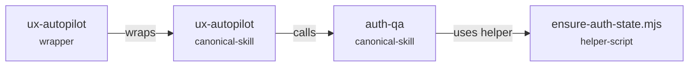

# Skillgraph

Skillgraph maps AI agent skills, wrapper docs, helper scripts, and workflow dependencies into a graph you can read, diff, and check in CI.

It is built for teams that have moved beyond one prompt file and now have many skills, commands, subagents, QA flows, design flows, and local helper scripts that quietly depend on each other.

## The Pain

Agent skill systems scale fast, then become hard to reason about:

- A design skill says it can run browser QA, but the actual login recovery lives somewhere else.
- An autopilot skill calls a QA skill, which calls a helper script, which depends on a saved auth state.
- A wrapper skill points to canonical instructions, but nobody knows whether it is stale.
- Multiple skills repeat the same rule with slightly different wording.
- CI fails because a helper script was renamed but the skill still references the old path.
- New contributors cannot tell which skill owns a workflow.
- Agents keep rediscovering the same relationships by reading every file again.

Skillgraph makes that hidden system visible.

## What It Generates

For a repo with skill docs under `.agents/skills` and mirrors under `.claude/skills`, Skillgraph emits:

- `SKILLGRAPH.md` - GitHub-renderable Mermaid workflow map plus tables.
- `skillgraph.html` - local interactive browser explorer.
- `skillgraph.json` - machine-readable graph for CI, dashboards, or other tools.

It detects:

- canonical skills
- wrapper or mirror skills
- skill-to-skill call/reference edges
- helper script references
- missing helper scripts
- duplicate skill names
- orphan skills
- custom stale patterns

## Quick Start

Install from GitHub:

```bash
npm install -D github:ming0627/skillgraph
npx skillgraph generate
```

Or run from a checkout:

```bash
git clone https://github.com/ming0627/skillgraph.git
cd skillgraph
npm test
npm run example:generate
open examples/basic/docs/skills/skillgraph.html
```

## Add To A Repo

Create `skillgraph.config.json`:

```json
{
  "$schema": "https://raw.githubusercontent.com/ming0627/skillgraph/main/schema/skillgraph.schema.json",
  "roots": [".agents/skills", ".claude/skills"],
  "outDir": "docs/skills",
  "canonicalRoots": [".agents/skills"],
  "wrapperRoots": [".claude/skills"],
  "privacy": {
    "includeEvidence": false,
    "redactTerms": ["secret-project-name", "person@example.com"]
  },
  "rules": {
    "stalePatterns": [
      {
        "id": "old-auth-default",
        "pattern": "OLD_TEST_ACCOUNT",
        "severity": "warn",
        "message": "Old test account reference is still present."
      }
    ]
  }
}
```

Add scripts:

```json
{
  "scripts": {
    "skills:graph": "skillgraph generate",
    "skills:graph:check": "skillgraph check",
    "skills:graph:audit": "skillgraph audit"
  }
}
```

Run:

```bash
npm run skills:graph
npm run skills:graph:check
```

## Privacy Model

Skillgraph does not output full skill contents. It emits relative paths, names, descriptions, inferred edges, optional evidence snippets, and issue metadata.

For public artifacts, use:

```json
{
  "privacy": {
    "includeEvidence": false,
    "redactTerms": ["internal-product", "person@example.com"]
  }
}
```

Before open-sourcing or publishing generated artifacts, run:

```bash
skillgraph privacy-scan --terms-file docs/private-leak-terms.txt
```

See [Privacy](docs/PRIVACY.md) for the recommended release checklist.

## Use Cases

- Map design, QA, auth, and deploy agent workflows.
- Find stale wrapper docs after moving canonical skills.
- See which high-level skills rely on login recovery, screenshots, browser automation, or deploy checks.
- Catch missing helper scripts before an agent reaches for them.
- Give new contributors a navigable map instead of a folder full of prompt files.
- Build a CI gate that fails when generated skill docs drift from source.

More examples are in [Use Cases](docs/USE_CASES.md).

## Example Output



## Commands

```bash
skillgraph generate
skillgraph check
skillgraph audit
skillgraph privacy-scan --terms-file docs/private-leak-terms.txt
```

## Status

Skillgraph is intentionally small and dependency-free. The current focus is deterministic local graph generation that is easy to review in a PR.

## License

MIT
