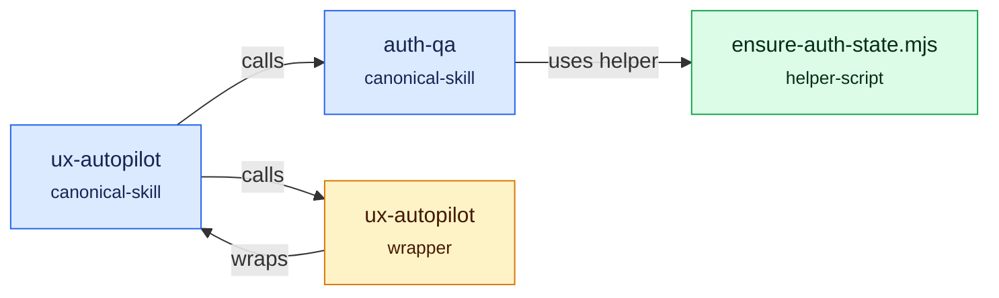

<!-- auto-generated by skillgraph -->
# Skillgraph

Generated: deterministic
Content hash: `c4d7bd491b37`

## Summary

- Nodes: 4
- Edges: 4
- Issues: 0
- Kinds: canonical-skill=2, wrapper=1, helper-script=1

## Workflow Map

## Issues

- No issues detected.

## Nodes

| Name | Kind | Path | Est. Tokens |
| --- | --- | --- | ---: |
| `auth-qa` | canonical-skill | `.agents/skills/auth-qa/SKILL.md` | 65 |
| `ux-autopilot` | canonical-skill | `.agents/skills/ux-autopilot/SKILL.md` | 57 |
| `ux-autopilot` | wrapper | `.claude/skills/ux-autopilot/SKILL.md` | 26 |
| `ensure-auth-state.mjs` | helper-script | `.agents/skills/auth-qa/scripts/ensure-auth-state.mjs` | 17 |

## Edges

| Source | Type | Target | Evidence |
| --- | --- | --- | --- |
| `auth-qa` | uses-helper | `ensure-auth-state.mjs` |  |
| `ux-autopilot` | calls | `auth-qa` |  |
| `ux-autopilot` | calls | `ux-autopilot` |  |
| `ux-autopilot` | wraps | `ux-autopilot` |  |
