<!-- auto-generated by skillgraph -->
# Skillgraph

Generated: deterministic
Content hash: `61fb79424a46`

## Summary

- Nodes: 39
- Edges: 179
- Issues: 3
- Kinds: skill-doc=20, canonical-skill=7, skill=3, wrapper=1, skill-package=1, helper-script=6, missing-helper=1
- Providers: Google Antigravity=4, Generic Agent Skills=7, Augment Code=6, Claude Code=2, Cline=3, Cursor=3, Factory AI=5, GitHub Copilot=4, Kilo Code=3, OpenAI Codex=1, Custom=3, Helper Script=7

## Provider Coverage

| Rank | Provider | Default roots | Basis |
| ---: | --- | --- | --- |
| 1 | GitHub Copilot | `.github/copilot-instructions.md`, `.github/instructions`, `.github/prompts`, `.github/agents`, `.github/chatmodes`, `AGENTS.md` | Largest public user signal among covered tools. |
| 2 | Cursor | `.cursor/rules`, `.cursorrules`, `AGENTS.md` | Large AI editor adoption and native project rules. |
| 3 | Claude Code | `CLAUDE.md`, `.claude/CLAUDE.md`, `.claude/skills`, `.claude/commands`, `.claude/agents`, `.claude/rules` | Major agentic coding tool with project memory, skills, commands, and subagents. |
| 4 | OpenAI Codex | `AGENTS.md`, `AGENTS.override.md` | Native AGENTS.md workflow and strong public open-source repository signal. |
| 5 | Cline | `.clinerules`, `.cursorrules`, `.windsurfrules`, `AGENTS.md`, `memory-bank` | Popular open-source VS Code autonomous coding agent. |
| 6 | Augment Code | `.augment/rules`, `.augment/agents`, `.augment-guidelines`, `.augment/code_review_guidelines.yaml`, `AGENTS.md`, `CLAUDE.md` | Commercial AI coding assistant with workspace rules, subagents, AGENTS.md, and review guidelines. |
| 7 | Kilo Code | `kilo.jsonc`, `kilo.json`, `.kilo/rules`, `.kilocode/rules`, `.kilocode/rules-code`, `.kilocoderules`, `AGENTS.md` | Popular open-source VS Code agent with project rules and JSONC instructions. |
| 8 | Google Antigravity | `GEMINI.md`, `AGENTS.md`, `.agent/rules`, `.agent/workflows`, `.agents/rules`, `.agents/workflows` | Google agent-first IDE with GEMINI.md, AGENTS.md, rules, and workflows. |
| 9 | Factory AI | `AGENTS.md`, `.factory/rules`, `.factory/skills`, `.factory/commands`, `.factory/droids` | Factory Droids use AGENTS.md plus Factory rules, skills, commands, and custom droids. |
| 10 | Generic Agent Skills | `.agents/skills` | Tool-agnostic skill roots used by multi-agent teams. |

## Workflow Map

```mermaid
flowchart LR
  classDef canonical fill:#dbeafe,stroke:#2563eb,color:#172554
  classDef wrapper fill:#fef3c7,stroke:#d97706,color:#451a03
  classDef helper fill:#dcfce7,stroke:#16a34a,color:#052e16
  classDef doc fill:#f3f4f6,stroke:#6b7280,color:#111827
  N0["invite-flow<br/><small>skill-doc</small>"]
  N1["release-train<br/><small>skill-doc</small>"]
  N2["auth-qa<br/><small>canonical-skill</small>"]
  N3["browser-qa<br/><small>canonical-skill</small>"]
  N4["implementation-workflow<br/><small>canonical-skill</small>"]
  N5["product-requirements<br/><small>canonical-skill</small>"]
  N6["release-gate<br/><small>canonical-skill</small>"]
  N7["review-gate<br/><small>canonical-skill</small>"]
  N8["rollback-runbook<br/><small>canonical-skill</small>"]
  N9["invite-flow<br/><small>skill-doc</small>"]
  N10["release-gate<br/><small>wrapper</small>"]
  N11["invite-flow<br/><small>skill-doc</small>"]
  N12["invite-flow<br/><small>skill-doc</small>"]
  N13["release-check<br/><small>skill-doc</small>"]
  N14["factory-release-reviewer<br/><small>skill</small>"]
  N15["invite-flow<br/><small>skill-doc</small>"]
  N16["release-handoff<br/><small>skill-doc</small>"]
  N17["review.instructions<br/><small>skill-doc</small>"]
  N18["write-tests.prompt<br/><small>skill-doc</small>"]
  N19["invite-flow<br/><small>skill-doc</small>"]
  N20[".augment-guidelines<br/><small>skill-doc</small>"]
  N21["code_review_guidelines<br/><small>skill-doc</small>"]
  N22[".cursorrules<br/><small>skill-doc</small>"]
  N23["copilot-instructions<br/><small>skill-doc</small>"]
  N24["AGENTS<br/><small>skill-doc</small>"]
  N25["GEMINI<br/><small>skill-doc</small>"]
  N26["AGENTS.fragment<br/><small>skill-doc</small>"]
  N27["release-gate<br/><small>skill</small>"]
  N28["release-gate<br/><small>skill-package</small>"]
  N29["ensure-auth-state.mjs<br/><small>helper-script</small>"]
  N30["run-browser-smoke.mjs<br/><small>helper-script</small>"]
  N31["check-acceptance.mjs<br/><small>helper-script</small>"]
  N32["release-preflight.sh<br/><small>helper-script</small>"]
  N33["diff-risk-check.mjs<br/><small>helper-script</small>"]
  N34["preflight.sh<br/><small>helper-script</small>"]
  N35["legacy-smoke.sh<br/><small>missing-helper</small>"]
  N0 -- "calls" --> N2
  N0 -- "calls" --> N3
  N0 -- "calls" --> N4
  N0 -- "calls" --> N5
  N0 -- "calls" --> N6
  N0 -- "calls" --> N7
  N0 -- "calls" --> N8
  N0 -- "calls" --> N10
  N0 -- "calls" --> N27
  N1 -- "calls" --> N2
  N1 -- "calls" --> N3
  N1 -- "calls" --> N4
  N1 -- "calls" --> N5
  N1 -- "calls" --> N6
  N1 -- "calls" --> N7
  N1 -- "calls" --> N8
  N1 -- "calls" --> N10
  N1 -- "calls" --> N27
  N2 -- "calls" --> N3
  N2 -- "uses helper" --> N29
  N3 -- "calls" --> N2
  N3 -- "uses helper" --> N30
  N4 -- "calls" --> N2
  N4 -- "calls" --> N5
  N4 -- "calls" --> N6
  N4 -- "calls" --> N7
  N4 -- "calls" --> N10
  N4 -- "calls" --> N27
  N5 -- "calls" --> N4
  N5 -- "uses helper" --> N31
  N6 -- "calls" --> N7
  N6 -- "calls" --> N8
  N6 -- "calls" --> N10
  N6 -- "calls" --> N27
  N6 -- "uses helper" --> N32
  N7 -- "calls" --> N2
  N7 -- "calls" --> N5
  N7 -- "calls" --> N6
  N7 -- "calls" --> N8
  N7 -- "calls" --> N10
  N7 -- "calls" --> N27
  N7 -- "uses helper" --> N33
  N8 -- "calls" --> N6
  N8 -- "calls" --> N10
  N8 -- "calls" --> N27
  N9 -- "calls" --> N2
  N9 -- "calls" --> N3
  N9 -- "calls" --> N4
  N9 -- "calls" --> N6
  N9 -- "calls" --> N7
  N9 -- "calls" --> N10
  N9 -- "calls" --> N27
  N10 -- "wraps" --> N6
  N10 -- "calls" --> N27
  N10 -- "uses helper" --> N35
  N11 -- "calls" --> N2
  N11 -- "calls" --> N3
  N11 -- "calls" --> N4
  N11 -- "calls" --> N7
  N12 -- "calls" --> N4
  N12 -- "calls" --> N5
  N13 -- "calls" --> N2
  N13 -- "calls" --> N3
  N13 -- "calls" --> N4
  N13 -- "calls" --> N5
  N13 -- "calls" --> N6
  N13 -- "calls" --> N7
  N13 -- "calls" --> N8
  N13 -- "calls" --> N10
  N13 -- "calls" --> N27
  N14 -- "calls" --> N6
  N14 -- "calls" --> N8
  N14 -- "calls" --> N10
  N14 -- "calls" --> N27
  N15 -- "calls" --> N2
  N15 -- "calls" --> N3
  N15 -- "calls" --> N4
  N15 -- "calls" --> N6
  N15 -- "calls" --> N7
  N15 -- "calls" --> N8
  N15 -- "calls" --> N10
  N15 -- "calls" --> N27
  N16 -- "calls" --> N6
  N16 -- "calls" --> N7
  N16 -- "calls" --> N8
  N16 -- "calls" --> N10
  N16 -- "calls" --> N27
  N17 -- "calls" --> N7
  N18 -- "calls" --> N2
  N18 -- "calls" --> N3
  N18 -- "calls" --> N4
  N19 -- "calls" --> N2
  N19 -- "calls" --> N3
  N19 -- "calls" --> N4
  N19 -- "calls" --> N6
  N19 -- "calls" --> N7
  N19 -- "calls" --> N10
  N19 -- "calls" --> N27
  N20 -- "calls" --> N2
  N20 -- "calls" --> N3
  N20 -- "calls" --> N4
  N20 -- "calls" --> N7
  N21 -- "calls" --> N6
  N21 -- "calls" --> N7
  N21 -- "calls" --> N10
  N21 -- "calls" --> N27
  N22 -- "calls" --> N2
  N22 -- "calls" --> N3
  N22 -- "calls" --> N7
  N23 -- "calls" --> N2
  N23 -- "calls" --> N3
  N23 -- "calls" --> N4
  N23 -- "calls" --> N5
  N23 -- "calls" --> N6
  N23 -- "calls" --> N7
  N23 -- "calls" --> N10
  N23 -- "calls" --> N27
  N24 -- "calls" --> N2
  N24 -- "calls" --> N3
  N24 -- "calls" --> N4
  N24 -- "calls" --> N5
  N24 -- "calls" --> N6
  N24 -- "calls" --> N7
  N24 -- "calls" --> N10
  N24 -- "calls" --> N27
  N25 -- "calls" --> N2
  N25 -- "calls" --> N3
  N25 -- "calls" --> N4
  N25 -- "calls" --> N5
  N25 -- "calls" --> N6
  N25 -- "calls" --> N7
  N25 -- "calls" --> N8
  N25 -- "calls" --> N10
  N25 -- "calls" --> N27
  N26 -- "calls" --> N6
  N26 -- "calls" --> N7
  N26 -- "calls" --> N8
  N26 -- "calls" --> N10
  N26 -- "calls" --> N27
  N26 -- "uses helper" --> N34
  N27 -- "calls" --> N7
  N27 -- "calls" --> N8
  N27 -- "uses helper" --> N34
  N28 -- "calls" --> N7
  N28 -- "calls" --> N8
  N28 -- "calls" --> N24
  N28 -- "calls" --> N26
  N28 -- "uses helper" --> N34
  class N0 doc
  class N1 doc
  class N2 canonical
  class N3 canonical
  class N4 canonical
  class N5 canonical
  class N6 canonical
  class N7 canonical
  class N8 canonical
  class N9 doc
  class N10 wrapper
  class N11 doc
  class N12 doc
  class N13 doc
  class N14 doc
  class N15 doc
  class N16 doc
  class N17 doc
  class N18 doc
  class N19 doc
  class N20 doc
  class N21 doc
  class N22 doc
  class N23 doc
  class N24 doc
  class N25 doc
  class N26 doc
  class N27 doc
  class N28 doc
  class N29 helper
  class N30 helper
  class N31 helper
  class N32 helper
  class N33 helper
  class N34 helper
  class N35 helper
```

## Issues

- **ERROR legacy-release-smoke:** Release wrapper points to a retired smoke script.
- **ERROR missing-helper:** Referenced helper does not exist: scripts/release/legacy-smoke.sh
- **WARN old-test-user:** Old shared QA user reference should be removed.

## Nodes

| Name | Provider | Kind | Path | Est. Tokens |
| --- | --- | --- | --- | ---: |
| `invite-flow` | Google Antigravity | skill-doc | `.agent/rules/invite-flow.md` | 53 |
| `release-train` | Google Antigravity | skill-doc | `.agent/workflows/release-train.md` | 49 |
| `auth-qa` | Generic Agent Skills | canonical-skill | `.agents/skills/auth-qa/SKILL.md` | 68 |
| `browser-qa` | Generic Agent Skills | canonical-skill | `.agents/skills/browser-qa/SKILL.md` | 62 |
| `implementation-workflow` | Generic Agent Skills | canonical-skill | `.agents/skills/implementation-workflow/SKILL.md` | 89 |
| `product-requirements` | Generic Agent Skills | canonical-skill | `.agents/skills/product-requirements/SKILL.md` | 99 |
| `release-gate` | Generic Agent Skills | canonical-skill | `.agents/skills/release-gate/SKILL.md` | 71 |
| `review-gate` | Generic Agent Skills | canonical-skill | `.agents/skills/review-gate/SKILL.md` | 76 |
| `rollback-runbook` | Generic Agent Skills | canonical-skill | `.agents/skills/rollback-runbook/SKILL.md` | 68 |
| `augment-release-reviewer` | Augment Code | skill | `.augment/agents/release-reviewer.md` | 70 |
| `invite-flow` | Augment Code | skill-doc | `.augment/rules/invite-flow.md` | 80 |
| `release-gate` | Claude Code | wrapper | `.claude/skills/release-gate/SKILL.md` | 55 |
| `invite-flow` | Cline | skill-doc | `.clinerules/invite-flow.md` | 44 |
| `invite-flow` | Cursor | skill-doc | `.cursor/rules/invite-flow.mdc` | 82 |
| `release-check` | Factory AI | skill-doc | `.factory/commands/release-check.md` | 45 |
| `factory-release-reviewer` | Factory AI | skill | `.factory/droids/release-reviewer.md` | 65 |
| `invite-flow` | Factory AI | skill-doc | `.factory/rules/invite-flow.md` | 62 |
| `release-handoff` | Factory AI | skill-doc | `.factory/skills/release-handoff.md` | 40 |
| `review.instructions` | GitHub Copilot | skill-doc | `.github/instructions/review.instructions.md` | 55 |
| `write-tests.prompt` | GitHub Copilot | skill-doc | `.github/prompts/write-tests.prompt.md` | 42 |
| `invite-flow` | Kilo Code | skill-doc | `.kilo/rules/invite-flow.md` | 51 |
| `.augment-guidelines` | Augment Code | skill-doc | `.augment-guidelines` | 29 |
| `code_review_guidelines` | Augment Code | skill-doc | `.augment/code_review_guidelines.yaml` | 68 |
| `.cursorrules` | Cursor / Cline | skill-doc | `.cursorrules` | 37 |
| `copilot-instructions` | GitHub Copilot | skill-doc | `.github/copilot-instructions.md` | 99 |
| `AGENTS` | GitHub Copilot / Cursor / OpenAI Codex / Cline / Augment Code / Kilo Code / Google Antigravity / Factory AI | skill-doc | `AGENTS.md` | 82 |
| `CLAUDE` | Claude Code / Augment Code | skill-doc | `CLAUDE.md` | 56 |
| `GEMINI` | Google Antigravity | skill-doc | `GEMINI.md` | 70 |
| `kilo` | Kilo Code | skill-doc | `kilo.jsonc` | 19 |
| `AGENTS.fragment` | Custom | skill-doc | `packages/release-gate/adapters/codex/AGENTS.fragment.md` | 82 |
| `release-gate` | Custom | skill | `packages/release-gate/SKILL.md` | 72 |
| `release-gate` | Custom | skill-package | `packages/release-gate/skillgraph.skill.json` | 229 |
| `ensure-auth-state.mjs` | Helper Script | helper-script | `.agents/skills/auth-qa/scripts/ensure-auth-state.mjs` | 27 |
| `run-browser-smoke.mjs` | Helper Script | helper-script | `.agents/skills/browser-qa/scripts/run-browser-smoke.mjs` | 18 |
| `check-acceptance.mjs` | Helper Script | helper-script | `.agents/skills/product-requirements/scripts/check-acceptance.mjs` | 26 |
| `release-preflight.sh` | Helper Script | helper-script | `.agents/skills/release-gate/scripts/release-preflight.sh` | 17 |
| `diff-risk-check.mjs` | Helper Script | helper-script | `.agents/skills/review-gate/scripts/diff-risk-check.mjs` | 16 |
| `preflight.sh` | Helper Script | helper-script | `packages/release-gate/scripts/release/preflight.sh` | 19 |
| `legacy-smoke.sh` | Helper Script | missing-helper | `scripts/release/legacy-smoke.sh` | 0 |

## Edges

| Source | Type | Target | Evidence |
| --- | --- | --- | --- |
| `invite-flow` | calls | `auth-qa` |  |
| `invite-flow` | calls | `browser-qa` |  |
| `invite-flow` | calls | `implementation-workflow` |  |
| `invite-flow` | calls | `product-requirements` |  |
| `invite-flow` | calls | `release-gate` |  |
| `invite-flow` | calls | `review-gate` |  |
| `invite-flow` | calls | `rollback-runbook` |  |
| `invite-flow` | calls | `release-gate` |  |
| `invite-flow` | calls | `release-gate` |  |
| `release-train` | calls | `auth-qa` |  |
| `release-train` | calls | `browser-qa` |  |
| `release-train` | calls | `implementation-workflow` |  |
| `release-train` | calls | `product-requirements` |  |
| `release-train` | calls | `release-gate` |  |
| `release-train` | calls | `review-gate` |  |
| `release-train` | calls | `rollback-runbook` |  |
| `release-train` | calls | `release-gate` |  |
| `release-train` | calls | `release-gate` |  |
| `auth-qa` | calls | `browser-qa` |  |
| `auth-qa` | references | `review-gate` |  |
| `auth-qa` | uses-helper | `ensure-auth-state.mjs` |  |
| `browser-qa` | calls | `auth-qa` |  |
| `browser-qa` | uses-helper | `run-browser-smoke.mjs` |  |
| `implementation-workflow` | calls | `auth-qa` |  |
| `implementation-workflow` | calls | `product-requirements` |  |
| `implementation-workflow` | calls | `release-gate` |  |
| `implementation-workflow` | calls | `review-gate` |  |
| `implementation-workflow` | calls | `release-gate` |  |
| `implementation-workflow` | calls | `release-gate` |  |
| `product-requirements` | calls | `implementation-workflow` |  |
| `product-requirements` | uses-helper | `check-acceptance.mjs` |  |
| `release-gate` | calls | `review-gate` |  |
| `release-gate` | calls | `rollback-runbook` |  |
| `release-gate` | calls | `release-gate` |  |
| `release-gate` | calls | `release-gate` |  |
| `release-gate` | uses-helper | `release-preflight.sh` |  |
| `review-gate` | calls | `auth-qa` |  |
| `review-gate` | calls | `product-requirements` |  |
| `review-gate` | calls | `release-gate` |  |
| `review-gate` | calls | `rollback-runbook` |  |
| `review-gate` | calls | `release-gate` |  |
| `review-gate` | calls | `release-gate` |  |
| `review-gate` | uses-helper | `diff-risk-check.mjs` |  |
| `rollback-runbook` | calls | `release-gate` |  |
| `rollback-runbook` | calls | `release-gate` |  |
| `rollback-runbook` | calls | `release-gate` |  |
| `augment-release-reviewer` | references | `auth-qa` |  |
| `augment-release-reviewer` | references | `browser-qa` |  |
| `augment-release-reviewer` | references | `implementation-workflow` |  |
| `augment-release-reviewer` | references | `release-gate` |  |
| `augment-release-reviewer` | references | `release-gate` |  |
| `augment-release-reviewer` | references | `release-gate` |  |
| `invite-flow` | calls | `auth-qa` |  |
| `invite-flow` | calls | `browser-qa` |  |
| `invite-flow` | calls | `implementation-workflow` |  |
| `invite-flow` | calls | `release-gate` |  |
| `invite-flow` | calls | `review-gate` |  |
| `invite-flow` | calls | `release-gate` |  |
| `invite-flow` | calls | `release-gate` |  |
| `release-gate` | wraps | `release-gate` |  |
| `release-gate` | calls | `release-gate` |  |
| `release-gate` | uses-helper | `legacy-smoke.sh` |  |
| `invite-flow` | calls | `auth-qa` |  |
| `invite-flow` | calls | `browser-qa` |  |
| `invite-flow` | calls | `implementation-workflow` |  |
| `invite-flow` | calls | `review-gate` |  |
| `invite-flow` | references | `auth-qa` |  |
| `invite-flow` | calls | `implementation-workflow` |  |
| `invite-flow` | calls | `product-requirements` |  |
| `invite-flow` | references | `review-gate` |  |
| `release-check` | calls | `auth-qa` |  |
| `release-check` | calls | `browser-qa` |  |
| `release-check` | calls | `implementation-workflow` |  |
| `release-check` | calls | `product-requirements` |  |
| `release-check` | calls | `release-gate` |  |
| `release-check` | calls | `review-gate` |  |
| `release-check` | calls | `rollback-runbook` |  |
| `release-check` | calls | `release-gate` |  |
| `release-check` | calls | `release-gate` |  |
| `factory-release-reviewer` | calls | `release-gate` |  |
| `factory-release-reviewer` | calls | `rollback-runbook` |  |
| `factory-release-reviewer` | calls | `release-gate` |  |
| `factory-release-reviewer` | calls | `release-gate` |  |
| `invite-flow` | calls | `auth-qa` |  |
| `invite-flow` | calls | `browser-qa` |  |
| `invite-flow` | calls | `implementation-workflow` |  |
| `invite-flow` | calls | `release-gate` |  |
| `invite-flow` | calls | `review-gate` |  |
| `invite-flow` | calls | `rollback-runbook` |  |
| `invite-flow` | calls | `release-gate` |  |
| `invite-flow` | calls | `release-gate` |  |
| `release-handoff` | calls | `release-gate` |  |
| `release-handoff` | calls | `review-gate` |  |
| `release-handoff` | calls | `rollback-runbook` |  |
| `release-handoff` | calls | `release-gate` |  |
| `release-handoff` | calls | `release-gate` |  |
| `review.instructions` | references | `release-gate` |  |
| `review.instructions` | calls | `review-gate` |  |
| `review.instructions` | references | `release-gate` |  |
| `review.instructions` | references | `release-gate` |  |
| `write-tests.prompt` | calls | `auth-qa` |  |
| `write-tests.prompt` | calls | `browser-qa` |  |
| `write-tests.prompt` | calls | `implementation-workflow` |  |
| `invite-flow` | calls | `auth-qa` |  |
| `invite-flow` | calls | `browser-qa` |  |
| `invite-flow` | calls | `implementation-workflow` |  |
| `invite-flow` | calls | `release-gate` |  |
| `invite-flow` | calls | `review-gate` |  |
| `invite-flow` | calls | `release-gate` |  |
| `invite-flow` | calls | `release-gate` |  |
| `.augment-guidelines` | calls | `auth-qa` |  |
| `.augment-guidelines` | calls | `browser-qa` |  |
| `.augment-guidelines` | calls | `implementation-workflow` |  |
| `.augment-guidelines` | calls | `review-gate` |  |
| `code_review_guidelines` | calls | `release-gate` |  |
| `code_review_guidelines` | calls | `review-gate` |  |
| `code_review_guidelines` | calls | `release-gate` |  |
| `code_review_guidelines` | calls | `release-gate` |  |
| `.cursorrules` | calls | `auth-qa` |  |
| `.cursorrules` | calls | `browser-qa` |  |
| `.cursorrules` | calls | `review-gate` |  |
| `copilot-instructions` | references | `invite-flow` |  |
| `copilot-instructions` | calls | `auth-qa` |  |
| `copilot-instructions` | calls | `browser-qa` |  |
| `copilot-instructions` | calls | `implementation-workflow` |  |
| `copilot-instructions` | calls | `product-requirements` |  |
| `copilot-instructions` | calls | `release-gate` |  |
| `copilot-instructions` | calls | `review-gate` |  |
| `copilot-instructions` | references | `invite-flow` |  |
| `copilot-instructions` | calls | `release-gate` |  |
| `copilot-instructions` | references | `invite-flow` |  |
| `copilot-instructions` | references | `invite-flow` |  |
| `copilot-instructions` | references | `invite-flow` |  |
| `copilot-instructions` | references | `invite-flow` |  |
| `copilot-instructions` | calls | `release-gate` |  |
| `AGENTS` | calls | `auth-qa` |  |
| `AGENTS` | calls | `browser-qa` |  |
| `AGENTS` | calls | `implementation-workflow` |  |
| `AGENTS` | calls | `product-requirements` |  |
| `AGENTS` | calls | `release-gate` |  |
| `AGENTS` | calls | `review-gate` |  |
| `AGENTS` | calls | `release-gate` |  |
| `AGENTS` | calls | `release-gate` |  |
| `CLAUDE` | references | `auth-qa` |  |
| `CLAUDE` | references | `browser-qa` |  |
| `CLAUDE` | references | `implementation-workflow` |  |
| `CLAUDE` | references | `product-requirements` |  |
| `CLAUDE` | references | `release-gate` |  |
| `CLAUDE` | references | `review-gate` |  |
| `CLAUDE` | references | `release-gate` |  |
| `CLAUDE` | references | `release-gate` |  |
| `GEMINI` | calls | `auth-qa` |  |
| `GEMINI` | calls | `browser-qa` |  |
| `GEMINI` | calls | `implementation-workflow` |  |
| `GEMINI` | calls | `product-requirements` |  |
| `GEMINI` | calls | `release-gate` |  |
| `GEMINI` | calls | `review-gate` |  |
| `GEMINI` | calls | `rollback-runbook` |  |
| `GEMINI` | calls | `release-gate` |  |
| `GEMINI` | calls | `release-gate` |  |
| `AGENTS.fragment` | calls | `release-gate` |  |
| `AGENTS.fragment` | calls | `review-gate` |  |
| `AGENTS.fragment` | calls | `rollback-runbook` |  |
| `AGENTS.fragment` | calls | `release-gate` |  |
| `AGENTS.fragment` | calls | `release-gate` |  |
| `AGENTS.fragment` | uses-helper | `preflight.sh` |  |
| `release-gate` | references | `release-gate` |  |
| `release-gate` | calls | `review-gate` |  |
| `release-gate` | calls | `rollback-runbook` |  |
| `release-gate` | references | `release-gate` |  |
| `release-gate` | uses-helper | `preflight.sh` |  |
| `release-gate` | references | `release-gate` |  |
| `release-gate` | calls | `review-gate` |  |
| `release-gate` | calls | `rollback-runbook` |  |
| `release-gate` | references | `release-gate` |  |
| `release-gate` | calls | `AGENTS` |  |
| `release-gate` | calls | `AGENTS.fragment` |  |
| `release-gate` | references | `release-gate` |  |
| `release-gate` | uses-helper | `preflight.sh` |  |
